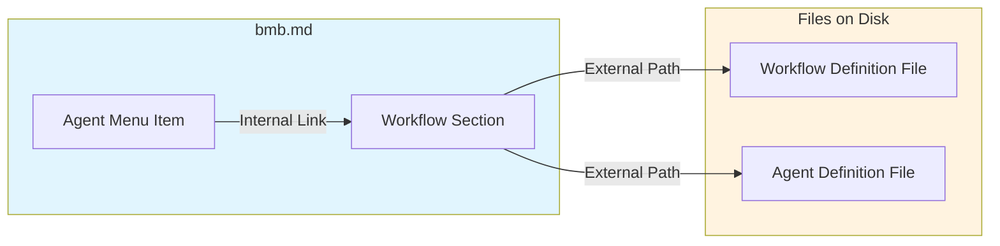
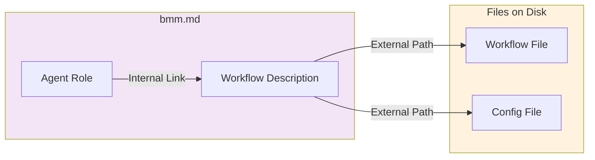
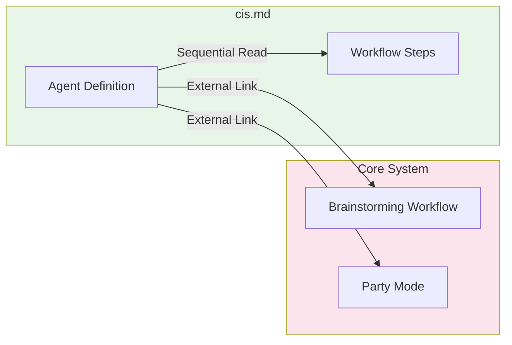

# 파일 구조 및 참조 관계 분석 (File Structure & Reference Analysis)

이 문서는 `bmb.md`, `bmm.md`, `cis.md`, `all_workflows.md` 파일의 내부 구조(Internal Structure)와 외부 참조(External References)를 상세하게 분석합니다.

## 1. 🏗️ BMB (Building Module Builder) - `bmb.md`

BMB 모듈은 "에이전트(Agents)"와 "워크플로우(Workflows)" 두 가지 주요 섹션으로 구성되어 있으며, 에이전트 메뉴에서 워크플로우 섹션으로 내부 링크가 연결되어 있습니다.

### 🔗 내부 참조 (Internal References)
에이전트 정의(`### Agents`)에서 해당 에이전트가 실행하는 워크플로우(`#### Workflows`)로 바로가기 링크가 설정되어 있습니다.

| 출발지 (Agent Menu) | 도착지 (Workflow Section) | 링크 텍스트 |
| :--- | :--- | :--- |
| `bmad-agent-bmb-agent-builder` | `#### bmad-bmb-create-agent` | `[workflow-create-agent.md]` |
| | `#### bmad-bmb-edit-agent` | `[workflow-edit-agent.md]` |
| | `#### bmad-bmb-validate-agent` | `[workflow-validate-agent.md]` |
| `bmad-agent-bmb-module-builder` | `#### bmad-bmb-create-module-brief` | `[workflow-create-module-brief.md]` |
| | `#### bmad-bmb-create-module` | `[workflow-create-module.md]` |
| | `#### bmad-bmb-edit-module` | `[workflow-edit-module.md]` |
| | `#### bmad-bmb-validate-module` | `[workflow-validate-module.md]` |
| `bmad-agent-bmb-workflow-builder` | `#### bmad-bmb-create-workflow` | `[workflow-create-workflow.md]` |
| | `#### bmad-bmb-edit-workflow` | `[workflow-edit-workflow.md]` |
| | `#### bmad-bmb-validate-workflow` | `[workflow-validate-workflow.md]` |
| | `#### bmad-bmb-validate-max-parallel-workflow` | `[workflow-validate-max-parallel-workflow.md]` |
| | `#### bmad-bmb-rework-workflow` | `[workflow-rework-workflow.md]` |

### 🧭 탐색 흐름도 (Navigation Flow)

### 🌏 외부 참조 (External References)
실제 실행 파일 및 설정 파일에 대한 참조입니다.

- **Config**: `_bmad/bmb/config.yaml` (모든 워크플로우에서 공통 참조)
- **Agent Definitions**:
    - `_bmad/bmb/agents/agent-builder.md`
    - `_bmad/bmb/agents/module-builder.md`
    - `_bmad/bmb/agents/workflow-builder.md`
- **Workflow Steps (Files on Disk)**:
    - `steps-c/step-01-brainstorm.md`
    - `steps-e/e-01-load-existing.md`
    - `_bmad/bmb/workflows/module/module-help-generate.md`
    - 등 다수의 `steps-*` 디렉토리 내 md 파일들

---

## 2. 🎨 BMM (Building Mood Maker) - `bmm.md`

BMM은 다양한 역할(Role)을 가진 에이전트들과 그들이 수행하는 업무(Workflows)를 정의합니다.

### 🔗 내부 참조 (Internal References)
에이전트별 기능 목록에서 하단의 상세 워크플로우 설명으로 연결됩니다.

| 에이전트 | 연결된 워크플로우 섹션 (Anchor) |
| :--- | :--- |
| **Analyst** | `#market-research`, `#domain-research`, `#technical-research`, `#create-product-brief` |
| **Architect** | `#create-architecture`, `#check-implementation-readiness` |
| **Developer** | `#dev-story`, `#code-review` |
| **PM** | `#create-prd`, `#validate-prd`, `#edit-prd`, `#create-epics-and-stories`, `#check-implementation-readiness`, `#correct-course` |
| **QA Engineer** | `#qa-automate` |
| **Quick Flow Solo Dev** | `#quick-spec`, `#quick-dev`, `#code-review` |
| **Scrum Master** | `#sprint-planning`, `#create-story`, `#retrospective`, `#correct-course` |
| **UX Designer** | `#create-ux-design` |

### 🧭 탐색 흐름도 (Navigation Flow)

### 🌏 외부 참조 (External References)
- **Core Dependencies** (타 모듈 참조):
    - `_bmad/core/workflows/brainstorming/workflow.md` (Analyst -> Brainstorming)
- **Workflow Definitions**:
    - `_bmad/bmm/workflows/...` 하위의 다양한 `.md` 및 `.yaml` 워크플로우 파일들
- **Templates & Data**:
    - `research.template.md`, `sprint-status.yaml`, `instructions.xml` 등

---

## 3. 💡 CIS (Creative Innovation Strategy) - `cis.md`

CIS는 창의적 혁신을 위한 6명의 특수 에이전트와 그들의 방법론을 정의합니다.

### 🔗 내부 참조 (Internal References)
이 파일은 내부 앵커(Anchor)를 통한 이동보다는, 에이전트와 워크플로우 정의가 순차적으로 나열된 구조입니다. 명시적인 내부 링크는 적지만 논리적으로 연결되어 있습니다.

### 🧭 탐색 흐름도 (Navigation Flow)

### 🌏 외부 참조 (External References)
CIS는 **BMAD Core (all_workflows.md 내용)** 에 대한 의존성이 가장 높습니다.

- **Core Workflows**:
    - `_bmad/core/workflows/brainstorming/workflow.md` (Brainstorming Coach)
    - `_bmad/core/workflows/party-mode/workflow.md` (모든 에이전트에서 공통 사용)
- **CIS Specific Workflows**:
    - `_bmad/cis/workflows/problem-solving/workflow.yaml`
    - `_bmad/cis/workflows/design-thinking/workflow.yaml`
    - `_bmad/cis/workflows/innovation-strategy/workflow.yaml`
    - `_bmad/cis/workflows/storytelling/workflow.yaml`
- **Data & Config**:
    - `_bmad/cis/config.yaml`
    - `*.csv` (brain-methods, solving-methods 등 방법론 데이터)

---

## 4. 🧩 All Workflows (Core) - `all_workflows.md`

이 파일은 BMAD 시스템의 **Core(핵심)** 기능들을 집대성한 문서입니다. `bmb`, `bmm`, `cis` 같은 모듈들이 공통으로 사용하는 기능의 "구현 상세"가 여기에 있습니다.

### 🔗 내부 구조 (Structure)
이 파일은 여러 개의 독립적인 워크플로우 정의 파일들을 하나로 합친 형태입니다.
- `bmad-master` (메인 에이전트)
- `brainstorming` (브레인스토밍)
- `party-mode` (파티 모드)
- `help` (도움말)
- 유틸리티 (`index-docs`, `shard-doc`, `editorial-review-*`, `review-adversarial`)

### 🌏 외부 참조 (External References)
이 파일은 시스템의 가장 바닥(Core)에 위치하므로, 다른 상위 모듈(`bmb`, `bmm` 등)을 참조하지 않습니다. 오직 자신의 구성 요소와 설정 파일만 참조합니다.

- **Config**: `_bmad/core/config.yaml`
- **Manifests**:
    - `_bmad/_config/task-manifest.csv`
    - `_bmad/_config/workflow-manifest.csv`
    - `_bmad/_config/bmad-help.csv`
- **Task Implementation**:
    - `_bmad/core/tasks/*.xml` (실제 태스크 수행 로직)

---

## 📊 종합 관계도 (Comprehensive Relationship Map)

```mermaid
graph LR
    %% ----------------------------------------------------------------
    %% 1. BMB (Building Module Builder)
    %% ----------------------------------------------------------------
    subgraph BMB ["BMB Agents"]
        Bond["Bond<br>(Agent Builder)"]
        Morgan["Morgan<br>(Module Builder)"]
        Wendy["Wendy<br>(Workflow Builder)"]
    end
    
    subgraph BMB_Workflows ["BMB Workflows"]
        W_CreateAgent["Create/Edit Agent"]
        W_CreateModule["Create/Edit Module"]
        W_CreateWorkflow["Create/Edit Workflow"]
    end
    
    Bond --> W_CreateAgent
    Morgan --> W_CreateModule
    Wendy --> W_CreateWorkflow
    
    %% BMB External Links
    W_CreateAgent -.-> path_bmb_agent["_bmad/bmb/workflows/agent/..."]
    W_CreateModule -.-> path_bmb_module["_bmad/bmb/workflows/module/..."]
    W_CreateWorkflow -.-> path_bmb_wf["_bmad/bmb/workflows/workflow/..."]

    %% ----------------------------------------------------------------
    %% 2. BMM (Building Mood Maker)
    %% ----------------------------------------------------------------
    subgraph BMM ["BMM Agents"]
        Analyst
        Architect
        Dev
        PM
        QA
        Solo["Solo Dev"]
        SM
        UX
    end

    subgraph BMM_Workflows ["BMM Workflows"]
        W_Market["Market Research"]
        W_Arch["Architecture"]
        W_Code["Dev/Code Review"]
        W_PRD["PRD/Epics"]
        W_QA["QA Automate"]
        W_Quick["Quick Spec/Dev"]
        W_Sprint["Sprint Planning"]
        W_Design["UX Design"]
    end

    Analyst --> W_Market
    Architect --> W_Arch
    Dev --> W_Code
    PM --> W_PRD
    QA --> W_QA
    Solo --> W_Quick
    SM --> W_Sprint
    UX --> W_Design

    %% BMM External Links (Simplified Paths)
    W_Market -.-> path_bmm_analysis["_bmad/bmm/workflows/1-analysis/..."]
    W_Arch -.-> path_bmm_solution["_bmad/bmm/workflows/3-solutioning/..."]
    W_Code -.-> path_bmm_impl["_bmad/bmm/workflows/4-implementation/..."]
    W_PRD -.-> path_bmm_plan["_bmad/bmm/workflows/2-plan-workflows/..."]
    W_QA -.-> path_bmm_qa["_bmad/bmm/workflows/qa/..."]
    W_Quick -.-> path_bmm_quick["_bmad/bmm/workflows/bmad-quick-flow/..."]

    %% ----------------------------------------------------------------
    %% 3. CIS (Creative Innovation Strategy)
    %% ----------------------------------------------------------------
    subgraph CIS ["CIS Agents"]
        Carson["Carson<br>(Brainstorming)"]
        Quinn["Quinn<br>(Problem Solving)"]
        Maya["Maya<br>(Design Thinking)"]
        Victor["Victor<br>(Innovation)"]
        Caravaggio["Caravaggio<br>(Presentation)"]
        Sophia["Sophia<br>(Storytelling)"]
    end

    subgraph CIS_Workflows ["CIS Workflows"]
        W_Prob["Problem Solving"]
        W_DT["Design Thinking"]
        W_Inno["Innovation Strategy"]
        W_Story["Storytelling"]
        W_Slide["Slide/Pitch Deck"]
    end

    Quinn --> W_Prob
    Maya --> W_DT
    Victor --> W_Inno
    Sophia --> W_Story
    Caravaggio --> W_Slide

    %% CIS External Links
    W_Prob -.-> path_cis_prob["_bmad/cis/workflows/problem-solving/..."]
    W_DT -.-> path_cis_dt["_bmad/cis/workflows/design-thinking/..."]
    W_Inno -.-> path_cis_inno["_bmad/cis/workflows/innovation-strategy/..."]
    W_Story -.-> path_cis_story["_bmad/cis/workflows/storytelling/..."]

    %% ----------------------------------------------------------------
    %% CORE SHARED (all_workflows.md)
    %% ----------------------------------------------------------------
    subgraph Core ["Core Shared Workflows"]
        Core_BS["Brainstorming"]
        Core_PM["Party Mode"]
    end

    %% Dependencies on Core
    Analyst --> Core_BS
    Carson --> Core_BS
    
    %% Party Mode is used by EVERYONE, so connecting from Module blocks to avoid clutter
    BMB -- "All Agents use" --> Core_PM
    CIS -- "All Agents use" --> Core_PM
    
    %% Core External Links
    Core_BS -.-> path_core_bs["_bmad/core/workflows/brainstorming/..."]
    Core_PM -.-> path_core_pm["_bmad/core/workflows/party-mode/..."]

    %% Styles
    classDef agent fill:#bbdefb,stroke:#1565c0,stroke-width:1px;
    classDef wf fill:#e1bee7,stroke:#4a148c,stroke-width:1px;
    classDef file fill:#fff3e0,stroke:#e65100,stroke-width:1px,stroke-dasharray: 5 5;
    classDef core fill:#c8e6c9,stroke:#2e7d32,stroke-width:2px;

    class Bond,Morgan,Wendy,Analyst,Architect,Dev,PM,QA,Solo,SM,UX,Carson,Quinn,Maya,Victor,Caravaggio,Sophia agent;
    class W_CreateAgent,W_CreateModule,W_CreateWorkflow,W_Market,W_Arch,W_Code,W_PRD,W_QA,W_Quick,W_Sprint,W_Design,W_Prob,W_DT,W_Inno,W_Story,W_Slide wf;
    class path_bmb_agent,path_bmb_module,path_bmb_wf,path_bmm_analysis,path_bmm_solution,path_bmm_impl,path_bmm_plan,path_bmm_qa,path_bmm_quick,path_cis_prob,path_cis_dt,path_cis_inno,path_cis_story,path_core_bs,path_core_pm file;
    class Core_BS,Core_PM core;
```

